# 红黑树

红黑树是一种含有红黑节点并且能自平衡的二叉查找树。

## 性质

* 1、每个节点要么是黑色，要么是红色。
* 2、根节点是黑色。
* 3、每个叶子节点(NIL)是黑色。
* 4、每个红色节点的两个子节点一定都是黑色。
* 5、任意一节点到每个叶子节点的路径都包含相同数量的黑节点。
* 5.1、若一节点存在黑色子节点，则该节点肯定有两个子节点。

红黑树并不是一个*完美*平衡二叉查找树，但任意一个结点到到每个叶子结点的路径都包含数量相同的黑结点(性质5)。所以红黑树这种平衡为**黑色完美平衡**。

## 自平衡

红黑树能自平衡，它靠的是三种操作：**左旋**、**右旋**和**变色**。

* **左旋**：以某个结点作为支点(旋转结点)，其右子结点变为旋转结点的父结点，右子结点的左子结点变为旋转结点的右子结点，左子结点保持不变。
* **右旋**：以某个结点作为支点(旋转结点)，其左子结点变为旋转结点的父结点，左子结点的右子结点变为旋转结点的左子结点，右子结点保持不变。
* **变色**：结点的颜色由红变黑或由黑变红。

**红黑树总是通过旋转和变色达到自平衡**。

## 查找

因为红黑树是一颗二叉平衡树，并且查找不会破坏树的平衡，所以查找跟二叉平衡树的查找无异：

>1.从根节点开始查找，把根节点设置为当前节点；
>
>2.若当前节点为空，返回null；
>
>3.若当前节点非空，用当前节点的key跟查找key做比较；
>
>4.若当前结点key等于查找key，那么该key就是查找目标，返回当前结点；
>
>5.若当前结点key大于查找key，把当前结点的左子结点设置为当前结点，重复步骤2；
>
>6.若当前结点key小于查找key，把当前结点的右子结点设置为当前结点，重复步骤2；

正由于红黑树总保持黑色完美平衡，所以它的查找最坏时间复杂度为O(2lgN)，也即整颗树刚好红黑相隔的时候。

## 插入

插入操作包含两部分工作：1.查找插入的位置；2.插入后自平衡。

查找插入的位置：

> 1.从根节点开始查找；
>
> 2.若根结点为空，那么插入结点作为根结点，结束。
>
> 3.若根结点不为空，那么把根结点作为当前结点；
>
> 4.若当前结点为null，返回当前结点的父结点，结束。
>
> 5.若当前结点key等于查找key，那么该key所在结点就是插入结点，更新结点的值，结束。
>
> 6.若当前结点key大于查找key，把当前结点的左子结点设置为当前结点，重复步骤4；
>
> 7.若当前结点key小于查找key，把当前结点的右子结点设置为当前结点，重复步骤4；

插入位置已找到，但插入结点是应该是什么颜色呢？

答案是**红色**。

理由很简单，红色在父结点（如果存在）为黑色结点时，红黑树的黑色平衡没被破坏，不需要做自平衡操作。但如果插入结点是黑色，那么插入位置所在的子树黑色结点总是多1，必须做自平衡。

插入情景如图所示：

### 插入情形1：红黑树为空树

把插入节点作为根节点，并设置节点为黑色。

### 插入情形2：插入节点Key已存在

插入结点的Key已存在，既然红黑树总保持平衡，在插入前红黑树已经是平衡的，那么把插入结点设置为将要替代结点的颜色，再把结点的值更新就完成插入。

**处理：**

* 把待插入节点的颜色设置为当前节点的颜色
* 更新当前节点的值为待插入节点的值

### 插入情景3：插入节点的父节点为黑色节点

由于插入的结点是红色的，当插入结点为黑色时，并不会影响红黑树的平衡，直接插入即可，无需做自平衡。

**处理：**直接插入。

### 插入情景4：插入节点的父节点为红节点

红黑色的性质2：根节点是黑色。如果插入节点的父节点为红节点，那么该父节点不可能为根节点，所以插入节点总是存在祖父节点。这点很重要，因为后续的旋转操作肯定需要祖父结点的参与。

#### 插入情景4.1：叔叔节点存在并且为红节点

红黑树性质4（每个红色节点的两个子节点一定都是黑色），可以确定祖父节点为黑节点，因为不可以同时存在两个相连的红结点。那么此时该插入子树的红黑层数的情况是：黑红红。显然最简单的处理方式是把其改为：红黑红。

**处理：**

* 将父节点和叔叔节点从红色设置为黑色
* 将祖父节点设置为黑色
* 将祖父节点设置为当前插入节点

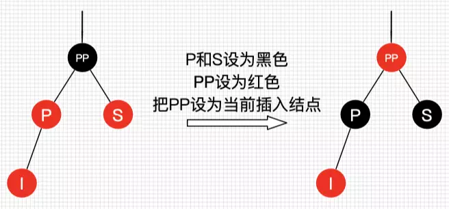

可以看到，我们把PP结点设为红色了，如果PP的父结点是黑色，那么无需再做任何处理；但如果PP的父结点是红色，根据性质4，此时红黑树已不平衡了，所以还需要把PP当作新的插入结点，继续做插入操作自平衡处理，直到平衡为止。

试想下PP刚好为根结点时，那么根据性质2，我们必须把PP重新设为黑色，那么树的红黑结构变为：黑黑红。换句话说，从根结点到叶子结点的路径中，黑色结点增加了。**这也是唯一一种会增加红黑树黑色结点层数的插入情景**。

我们还可以总结出另外一个经验：**红黑树的生长是自底向上的**。这点不同于普通的二叉查找树，普通的二叉查找树的生长是自顶向下的。

#### 插入情景4.2：叔叔节点不存在或为黑节点，并插入节点的父亲节点是祖父节点的左子节点

单纯从插入前来看，也即不算情景4.1自底向上处理时的情况，叔叔结点非红即为叶子结点(Nil)。因为如果叔叔结点为黑结点，而父结点为红结点，那么叔叔结点所在的子树的黑色结点就比父结点所在子树的多了，这不满足红黑树的性质5。

前文说了，需要旋转操作时，肯定一边子树的结点多了或少了，需要租或借给另一边。插入显然是多的情况，那么把多的结点租给另一边子树就可以了。

##### 插入情景4.2.1：插入节点是其父节点的左子节点

**处理：**

* 将父节点设置为黑色
* 将祖父节点设置为红色
* 对祖父节点进行右旋

左边两个红结点，右边不存在，那么一边一个刚刚好，并且因为为红色，肯定不会破坏树的平衡。

##### 插入情景4.2.2：插入节点是其父节点的右子节点

**处理：**

* 对父节点左旋
* 设置父亲节点为插入节点，得到情景4.2.1
* 进行情景4.2.1的处理

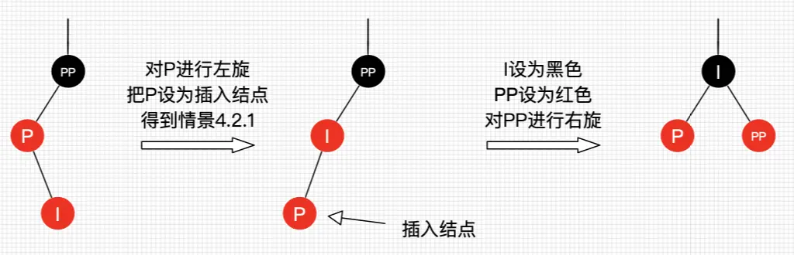

#### 插入情景4.3：叔叔节点不存在或为黑色节点，并且插入节点的父节点是祖父节点的右子节点

该情景对应情景4.2，只是方向反转，不做过多说明了，直接看图。

##### 插入情景4.3.1：插入节点是其父节点的右子节点

**处理：**

* 将父节点设置为黑色
* 将祖父节点设置为红色
* 对祖父节点进行左旋

##### 插入情景4.3.2：插入节点是其父节点的坐子节点

**处理：**

* 对父节点右旋
* 把父节点设置为插入节点，得到情景4.3.1
* 进行4.3.1的处理

## 删除

红黑树插入已经够复杂了，但删除更复杂，也是红黑树最复杂的操作了。

红黑树的删除操作也包括两部分工作：一.查找目标结点；二.删除后自平衡。

查找目标结点显然可以复用查找操作，当不存在目标结点时，忽略本次操作；当存在目标结点时，删除后就得做自平衡处理了。删除了结点后我们还需要找结点来替代删除结点的位置，不然子树跟父辈结点断开了，除非删除结点刚好没子结点，那么就不需要替代。

二叉树删除结点找替代结点有3种情情景：

* 1：若删除节点无子节点，直接删除
* 2：若删除节点只有一个子节点，用子节点替换删除节点
* 3：若删除节点有两个子节点，用后继结点（大于删除结点的最小结点）替换删除结点

情景3的后继结点是大于删除结点的最小结点，也是删除结点的右子树种最左结点。

一个重要的思路：**删除结点被替代后，在不考虑结点的键值的情况下，对于树来说，可以认为删除的是替代结点！**话很苍白，我们看图。在不看键值对的情况下，图17的红黑树最终结果是删除了Q所在位置的结点！这种思路非常重要，大大简化了后文讲解红黑树删除的情景！

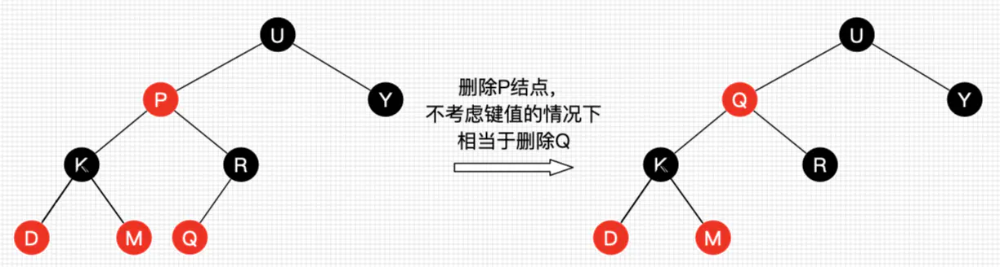

基于此，上面所说的3种二叉树的删除情景可以相互转换并且最终都是转换为情景1！

* 情景2：删除结点用其唯一的子结点替换，子结点替换为删除结点后，可以认为删除的是子结点，若子结点又有两个子结点，那么相当于转换为情景3，一直自顶向下转换，总是能转换为情景1。（对于红黑树来说，根据性质5.1，只存在一个子结点的结点肯定在树末了）
* 情景3：删除结点用后继结点（肯定不存在左结点），如果后继结点有右子结点，那么相当于转换为情景2，否则转为为情景1。

综上所述，**删除操作删除的结点可以看作删除替代结点，而替代结点最后总是在树末。**有了这结论，我们讨论的删除红黑树的情景就少了很多，因为我们只考虑删除树末结点的情景了。

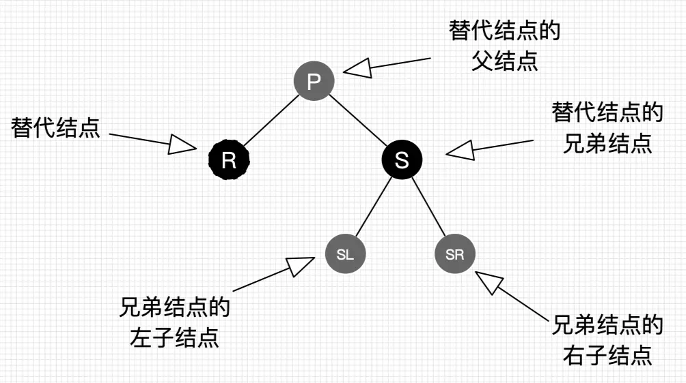

灰色结点表示它可以是红色也可以是黑色。

值得特别提醒的是，**R是即将被替换到删除结点的位置的替代结点，在删除前，它还在原来所在位置参与树的子平衡，平衡后再替换到删除结点的位置，才算删除完成。**

### 删除情景1：替换节点是红色节点

我们把替换结点换到了删除结点的位置时，由于替换结点时红色，删除也了不会影响红黑树的平衡，只要把替换结点的颜色设为删除的结点的颜色即可重新平衡。

**处理：**颜色变为删除结点的颜色

### 删除情景2：替换节点是黑色节点

当替换结点是黑色时，我们就不得不进行自平衡处理了。我们必须还得考虑替换结点是其父结点的左子结点还是右子结点，来做不同的旋转操作，使树重新平衡。

#### 删除情景2.1：替换节点是其父节点的左子节点

#### 删除情景2.1.1：替换节点的兄弟节点是红色节点

若兄弟结点是红结点，那么根据性质4，兄弟结点的父结点和子结点肯定为黑色，不会有其他子情景，我们按以下处理，得到删除情景2.1.2.3（后续讲解，这里先记住，此时R仍然是替代结点，它的新的兄弟结点SL和兄弟结点的子结点都是黑色）。

**处理：**

* 将S设置为黑色

* 将P设置为红色

* 对P进行左旋，得到情景2.1.2.3

* 进行情景2.1.2.3的处理

  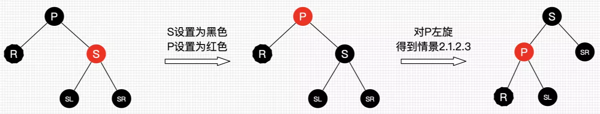

#### 删除情景2.1.2：替换节点的兄弟节点是黑节点

当兄弟结点为黑时，其父结点和子结点的具体颜色也无法确定（如果也不考虑自底向上的情况，子结点非红即为叶子结点Nil，Nil结点为黑结点），此时又得考虑多种子情景。

##### 删除情景2.1.2.1：替换节点的兄弟节点的右子节点是红色节点，左子节点任意颜色

即将删除的左子树的一个黑色结点，显然左子树的黑色结点少1了，然而右子树又又红色结点，那么我们直接向右子树“借”个红结点来补充黑结点就好啦，此时肯定需要用旋转处理了。

**处理：**

* 将S的颜色设置为P的颜色
* 将P设置为黑色
* 将SR设置为黑色
* 对P进行左旋

平衡后的图怎么不满足红黑树的性质？前文提醒过，R是即将替换的，它还参与树的自平衡，平衡后再替换到删除结点的位置，所以R最终可以看作是删除的。另外图2.1.2.1是考虑到第一次替换和自底向上处理的情况，如果只考虑第一次替换的情况，根据红黑树性质，SL肯定是红色或为Nil，所以最终结果树是平衡的。如果是自底向上处理的情况，同样，每棵子树都保持平衡状态，最终整棵树肯定是平衡的。

##### 删除情景2.1.2.2：**替换结点的兄弟结点的右子结点为黑结点，左子结点为红结点**

兄弟结点所在的子树有红结点，我们总是可以向兄弟子树借个红结点过来，显然该情景可以转换为情景2.1.2.1。

**处理：**

* 将S设置为红色
* 将SL设置为黑色
* 对S进行右旋，得到情景2.1.2.1
* 进行情景2.1.2.1的处理

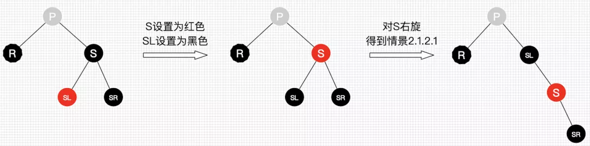

##### 删除情景2.1.2.3：**替换结点的兄弟结点的子结点都为黑结点**

好了，此次兄弟子树都没红结点“借”了，兄弟帮忙不了，找父母呗，这种情景我们把兄弟结点设为红色，再把父结点当作替代结点，自底向上处理，去找父结点的兄弟结点去“借”。但为什么需要把兄弟结点设为红色呢？显然是为了在P所在的子树中保证平衡（R即将删除，少了一个黑色结点，子树也需要少一个），后续的平衡工作交给父辈们考虑了，还是那句，当每棵子树都保持平衡时，最终整棵总是平衡的。

**处理：**

* 将S设置为红色
* 把P作为新的替换节点
* 重新进行删除节点情景处理

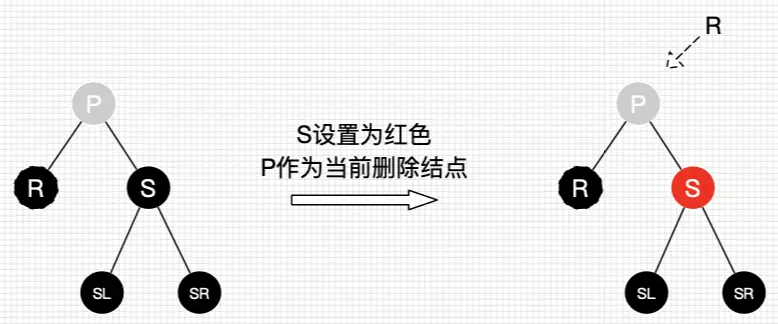

#### 删除情景2.2：**替换结点是其父结点的右子结点**

#### 删除情景2.2.1：替换结点的兄弟结点是红结点

**处理：**

- 将S设为黑色
- 将P设为红色
- 对P进行右旋，得到情景2.2.2.3
- 进行情景2.2.2.3的处理

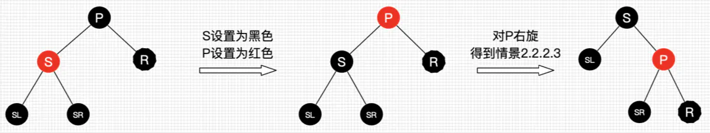

##### 删除情景2.2.2：替换结点的兄弟结点是黑结点

##### 删除情景2.2.2.1：替换结点的兄弟结点的左子结点是红结点，右子结点任意颜色

**处理：**

- 将S的颜色设为P的颜色
- 将P设为黑色
- 将SL设为黑色
- 对P进行右旋

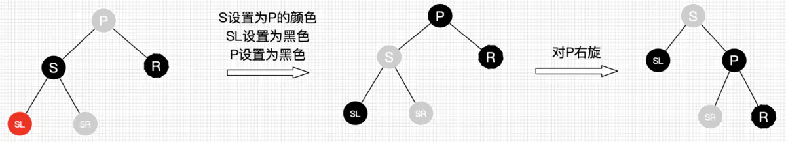

##### 删除情景2.2.2.2：替换结点的兄弟结点的左子结点为黑结点，右子结点为红结点

**处理：**

- 将S设为红色
- 将SR设为黑色
- 对S进行左旋，得到情景2.2.2.1
- 进行情景2.2.2.1的处理

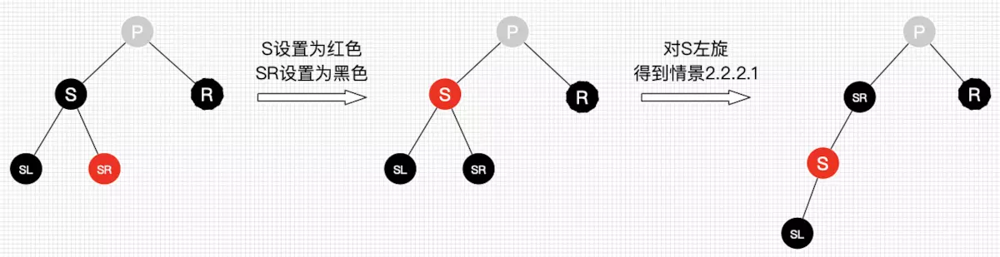

##### 删除情景2.2.2.3：替换结点的兄弟结点的子结点都为黑结点

**处理：**

- 将S设为红色
- 把P作为新的替换结点
- 重新进行删除结点情景处理

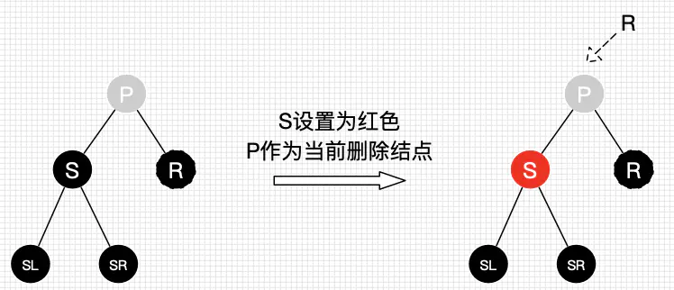

综上，红黑树删除后自平衡的处理可以总结为：

1. 自己能搞定的自消化（情景1）
2. 自己不能搞定的叫兄弟帮忙（除了情景1、情景2.1.2.3和情景2.2.2.3）
3. 兄弟都帮忙不了的，通过父母，找远方亲戚（情景2.1.2.3和情景2.2.2.3）

## Reference

https://www.cnblogs.com/skywang12345/p/3624291.html

https://www.jianshu.com/p/e136ec79235c